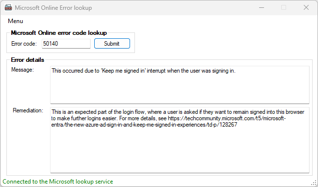

# MicrosoftOnlineErrorLookupTool

This repository contains a code for the tool there helps you look up Microsoft Online error codes and their descriptions. It is designed to assist administrators and users in quickly identifying and understanding error messages encountered while using Microsoft Online services.

## Features
- **Error Code Lookup**: Enter an error code to retrieve its description and possible solutions.